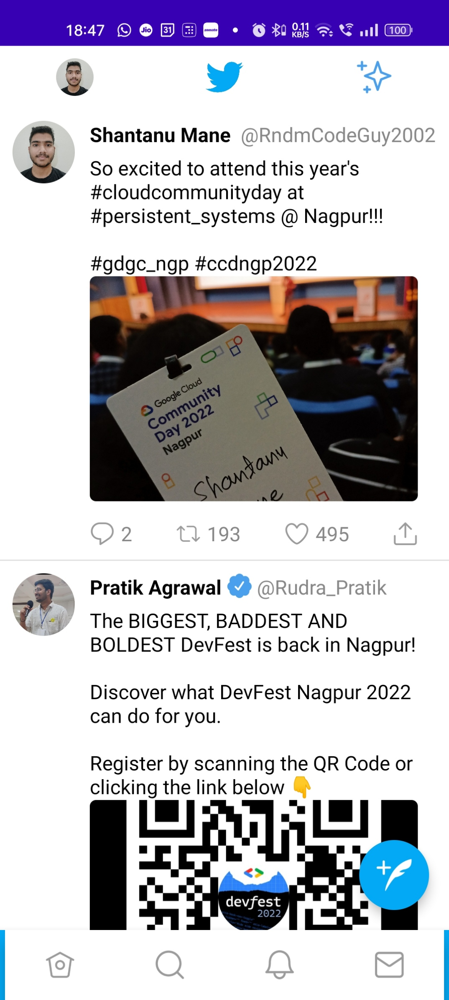
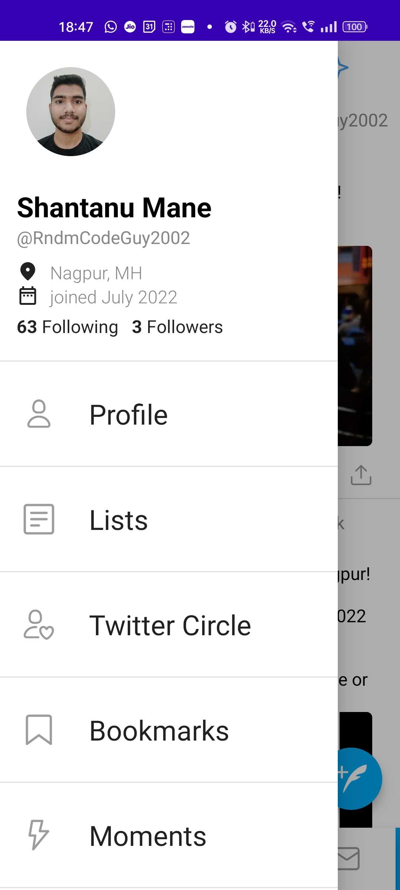
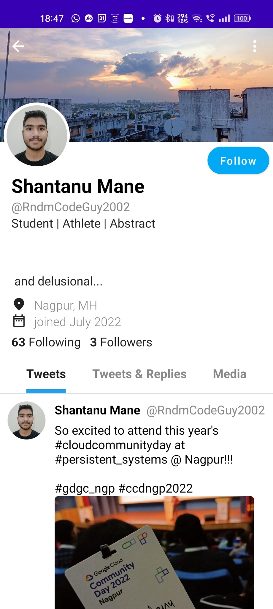
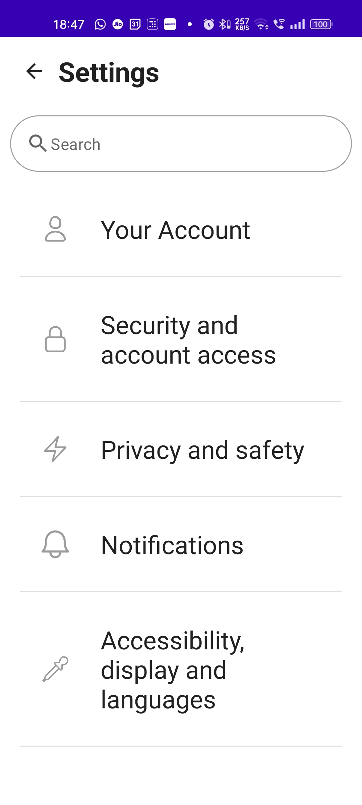

# Twitter Clone App (JetWitter)

Twitter app clone using jetpack compose and android.

## Problem Statement ➡️

**Clone App**: Recreate four or more screens of any play store application (with >=50000 downloads)
using *Jetpack Compose*. You can choose to make clones of social media apps, music apps or any other
application that is commonly used in your region.

## Proposed Solution With Screenshots ➡️

I have created a simple and accessible twitter clone using JetPack Compose, the driving factor for
creating this app was `minimalism`. We all know how tech giants are modifying their application UI
to be more `aesthetic` and `accessible` catering a large group of individuals in which most the
proportion is represented by the `GenZ`. Creating this an app which looks great, feels great and
most of all works great was the main goal of this project.

### Screenshots ➡️

|  |  |
| ----------------------------------------------------------------------------------------- | ----------------------------------------------------------------------------------------- |
|  |  |

### Functionality & Concepts Used ➡️

**Functionality** : In this application I've implemented some of the index concepts such as
Scaffolding, navigation and routing, user can view profile, scroll through tweets. Data from a data
source may it be on the machine or in the cloud can be accessed and fed into all the components.
Code reusability and clean architecture is implemented.

**Concepts Used :** The following concepts were used to build the app :

- Scaffold

- Layouts

- Constraint Layout

- Lazy Columns

- State Management

- Material Design

- View Model

- UI Navigation

- Animations

## Application Link and Future Scope

Application can be accessed
from [here](https://drive.google.com/drive/folders/1h1hHoEM-0ZWe9klSKRMCLoQ4h89B-ABM?usp=sharing)

Currently the app takes data from a static data source and is unresponsive to the input given by the
user. Future developments will include :

1. Fetching data fom a dynamic API which has all the CRUD capabilities.

2. Updating data stored at remote location by taking user input.

3. Make the application react visually (animations) to any input given by the user.
